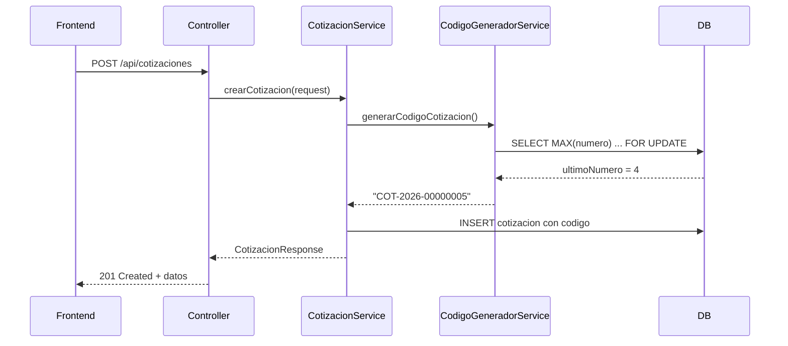

# 📋 Sistema de Generación de Códigos de Cotización

## 🎯 Descripción General

Sistema de generación automática de códigos únicos para cotizaciones, implementado completamente en el **backend (Java)** sin lógica de negocio en la base de datos.

**Formato:** `COT-YYYY-NNNNNNNN` (8 dígitos)  
**Ejemplo:** `COT-2026-00000001`

**Capacidad:** 99,999,999 cotizaciones por año

---

## 🏗️ Arquitectura

### **Backend genera el código** (✅ Implementado)
- ❌ NO usa triggers de base de datos
- ❌ NO usa stored procedures
- ❌ NO usa tabla adicional de secuencias
- ✅ Lógica de negocio en Java
- ✅ Usa `MAX()` + `FOR UPDATE` sobre tabla cotizacion
- ✅ Control de concurrencia con locks transaccionales
- ✅ Base de datos limpia (Clean Architecture)

### **Estrategia: MAX() sobre tabla existente**
```java
// Consulta el máximo número usado para el año
SELECT MAX(SUBSTRING(numeroCotizacion FROM 10)) 
FROM cotizacion 
WHERE numeroCotizacion LIKE 'COT-2026-%'
FOR UPDATE
```

---

## 📂 Archivos Creados/Modificados

### 1️⃣ **Base de Datos**
- ✅ `06-tabla-secuencia-cotizacion.sql` - Índice optimizado para MAX()

### 2️⃣ **Backend - Servicio**
- ✅ `CodigoGeneradorService.java` - Generador de códigos
- ✅ `CotizacionService.java` - Modificado para inyectar CodigoGeneradorService

### 3️⃣ **Backend - Controller**
- ✅ `CotizacionController.java` - Nuevo endpoint POST /api/cotizaciones

### 4️⃣ **Backend - DTO**
- ✅ `CotizacionCreateRequest.java` - DTO para crear cotización

---

## 🔧 Flujo de Generación



---

## 📍 Puntos de Generación

### 🆕 **1. Crear nueva cotización**
```java
// CotizacionService.crearCotizacion()
String codigo = codigoGenerador.generarCodigoCotizacion();
cotizacion.setNumeroCotizacion(codigo);
```

**Endpoint:** `POST /api/cotizaciones`  
**Resultado:** `COT-2026-00000001` v1 (código nuevo)

### 🔄 **2. Versionar cotización existente (modificar items)**
```java
// CotizacionService.versionarCotizacion()
// ⭐ MANTIENE EL MISMO CÓDIGO (no genera nuevo)
nueva.setNumeroCotizacion(anterior.getNumeroCotizacion());
```

**Endpoint:** `POST /api/cotizaciones/{id}/versionar`  
**Resultado:** `COT-2026-00000001` v2 (mismo código, versión +1)

---

## 🔍 Diferencia entre Versionar y Crear Nueva

| Operación | Código | Versión | Uso |
|-----------|--------|---------|-----|
| **Versionar** | Mantiene | +1 | Modificar items de cotización existente |
| **Crear Nueva** | Genera nuevo | 1 | Cotización completamente nueva para el cliente |

**Ejemplo:**
```
Cliente tiene:
- COT-2026-00000001 v1 → versiona → COT-2026-00000001 v2 → versiona → COT-2026-00000001 v8
- COT-2026-00000033 v1

Crea nueva cotización:
- COT-2026-00000046 v1 ✅ (código totalmente nuevo)
```

---

## 🔐 Manejo de Concurrencia

### **Problema:**
Dos usuarios crean cotización al mismo tiempo → Podrían obtener el mismo número

### **Solución:**
```sql
SELECT siguiente_numero FROM cotizacion_secuencia 
WHERE aMAX(SUBSTRING(numeroCotizacion FROM 10)) 
FROM cotizacion 
WHERE numeroCotizacion LIKE 'COT-2026-%'
FOR UPDATE; -- ⭐ LOCK transaccional (espera hasta que transacción anterior termine)
```

### **Resultado:**
- ✅ Usuario A obtiene MAX = 4, bloquea con lock
- ⏳ Usuario B espera
- ✅ Usuario A inserta COT-2026-00000005 y hace COMMIT
- ✅ Usuario B obtiene MAX = 5, inserta COT-2026-00000006
---

## 📊 Límites y Validaciones

| Concepto | Valor |
|----------|-------|
| Dígitos | 8 |
| Máximo/año | 99,999,999 |
| Validación | `if (numero > 99999999) throw Exception` |
| Reinicio | Automático cada año |

---

## 🧪 Casos de Uso

### ✅ **Caso 1: Crear primera cotización del año**
```No hay cotizaciones con patrón 'COT-2026-%'
MAX() retorna: 0
Backend genera: COT-2026-00000001
```

### ✅ **Caso 2: Año nuevo sin cotizaciones previas**
```
BD: No hay cotizaciones con patrón 'COT-2027-%'
MAX() retorna: 0
Backend detecta y crea: INSERT anio=2027, siguiente_numero=1
Backend genera: COT-2027-00000001
```

### ✅ **Caso 3: Borrador eliminado**
```
Se genera: COT-2026-00000005
Usuario elimina borrador
Resultado: Número "perdido" (no se reutiliza)
Siguiente: COT-2026-00000006
```

> ⚠️ **Decisión de diseño:** Los números no se reutilizan aunque se eliminen borradores

---

## 🛠️ API Reference

### **POST /api/cotizaciones**
Crea una nueva cotización con código auto-generado

**Request:**
```json
{
  "idContrato": "550e8400-e29b-41d4-a716-446655440000",
  "idUsuarioCreacion": "user123",
  "fechaEmision": "2026-01-13",
  "fechaVigenciaDesde": "2026-02-01",
  "fechaVigenciaHasta": "2027-02-01",
  "observacion": "Nueva cotización"
}
```

**Response:** `201 Created`
```json
{
  "idCotizacion": "a1b2c3d4-e5f6-7890-abcd-ef1234567890",
  "idContrato": "550e8400-e29b-41d4-a716-446655440000",
  "numeroCotizacion": "COT-2026-00000001", ⭐
  "version": 1,
  "estadoNombre": "BORRADOR",
  "observacion": "Nueva cotización"
}
```

---

## ⚙️ Métodos del Servicio

### **CodigoGeneradorService**

```java
// Generar código para año actual
String codigo = codigoGenerador.generarCodigoCotizacion();
// → "COT-2026-00000123"

// Generar código para año específico
String codigo = codigoGenerador.generarCodigoCotizacion(2027);
// → "COT-2027-00000001"

// Consultar siguiente número (sin consumir)
int siguiente = codigoGenerador.obtenerSiguienteNumero(2026);
// → 124
Contar cotizaciones de un año
int cantidad = codigoGenerador.contarCotizacionesPorAnio(2026);
// → 123encia(2026, 1000);
// → Próximo número será 1000
```

---

## 🚀 Instalación y Configuración

### **1. Ejecutar script SQL (crear índice)**
```bash
mysql -u root -p cmdb_tech < src/main/resources/db/06-tabla-secuencia-cotizacion.sql
```

### **2. Verificar índice creado**
```sql
SHOW INDEX FROM cotizacion WHERE Key_name = 'idx_cotizacion_numero_codigo';
```

### **3. Compilar backend**
```bash
mvn clean install
```

### **4. Iniciar aplicación**
```bash
mvn spring-boot:run
```

---

## 📝 Decisiones de Diseño

### ✅ **Ventajas de esta implementación:**

1. **Lógica en Backend**
   - Fácil de testear (unit tests)
   - Fácil de modificar sin cambiar BD
   - Código Java legible y mantenible

2. **Base de Datos Limpia (Clean Architecture)**
   - ✅ Sin tabla adicional de secuencias
   - ✅ Solo un índice para optimización
   - ✅ Menos complejidad en BD

3. **Sin Triggers ni Stored Procedures**
   - No hay "magia" oculta en la BD
   - Más fácil debug
   - Portable a otras BD

4. **Manejo de Concurrencia Robusto**
   - `SELECT MAX() ... FOR UPDATE` garantiza unicidad
   - Spring Transaction Manager maneja rollbacks
   - Sin race conditions

5. **Códigos Únicos desde el Inicio**
   - Incluso borradores tienen código único
   - Trazabilidad completa
   - No hay confusión con UUID

6. **Rendimiento Optimizado**
   - Índictransaccional en SELECT MAX()**
   - Bloquea durante la transacción completa
   - ✅ Aceptable: Lock duration ~1-5ms, imperceptible

3. **No optimizado para volúmenes extremos**
   - Para > 500K cotizaciones/año, tabla de secuencia sería mejor
   - ✅ Aceptable: CMDB no alcanzamedios (< 100K/año)

### ⚠️ **Trade-offs aceptados:**

1. **Números "perdidos"**
   - Si borras borrador, número no se reutiliza
   - ✅ Aceptable: 99M códigos/año es suficiente

2. **Lock en tabla de secuencias**
   - Podría ser cuello de botella con miles de creaciones simultáneas
   - ✅ Aceptable: CMDB no tiene ese volumen

---

## 🔍 Troubleshooting

### **Error: "Se ha excedido el límite"**
```
Causa: Se usaron 99,999,999 códigos en un año
Solución: Expandir a 9 dígitos o usar formato diferente
```

### **Error: "Error al generar código"**
```
Causa: Problema de conexión o transacción
Solución: Verificar logs, rollback automático
```

### **Códigos duplicados**
```
Causa: No debería pasar con SELECT FOR UPDATE
Solución: Verificar que @Transactional está presente
```
Índice `idx_cotizacion_numero_codigo` creado
- [x] `CodigoGeneradorService` implementado con MAX()
- [x] `CotizacionService` modificado (crear + versionar)
- [x] `CotizacionController` con POST endpoint
- [x] `CotizacionCreateRequest` DTO creado
- [x] Manejo de concurrencia con FOR UPDATE
- [x] Validación de límites (99,999,999)
- [x] Logs para debugging
- [x] Clean Architecture: sin tabla adicional.java](../src/main/java/com/telefonicatech/cmdbChile/service/CodigoGeneradorService.java) - Generador
- [06-tabla-secuencia-cotizacion.sql](../src/main/resources/db/06-tabla-secuencia-cotizacion.sql) - Schema

---

## ✅ Checklist de Implementación

- [x] Tabla `cotizacion_secuencia` creada
- [x] `CodigoGeneradorService` implementado
- [x] `CotizacionService` modificado (crear + versionar)
- [x] `CotizacionController` con POST endpoint
- [x] `CotizacionCreateRequest` DTO creado
- [x] Manejo de concurrencia con FOR UPDATE
- [x] Validación de límites (99,999,999)
- [x] Logs para debugging
- [ ] Tests unitarios (pendiente)
- [ ] Tests de integración (pendiente)
- [ ] Documentación en Swagger (pendiente)

---

**Última actualización:** 13 de enero de 2026  
**Autor:** Sistema CMDB Chile  
**Versión:** 1.0
